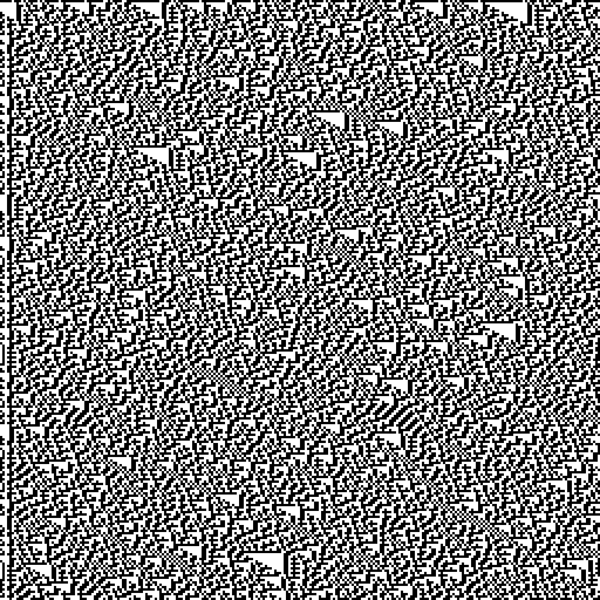
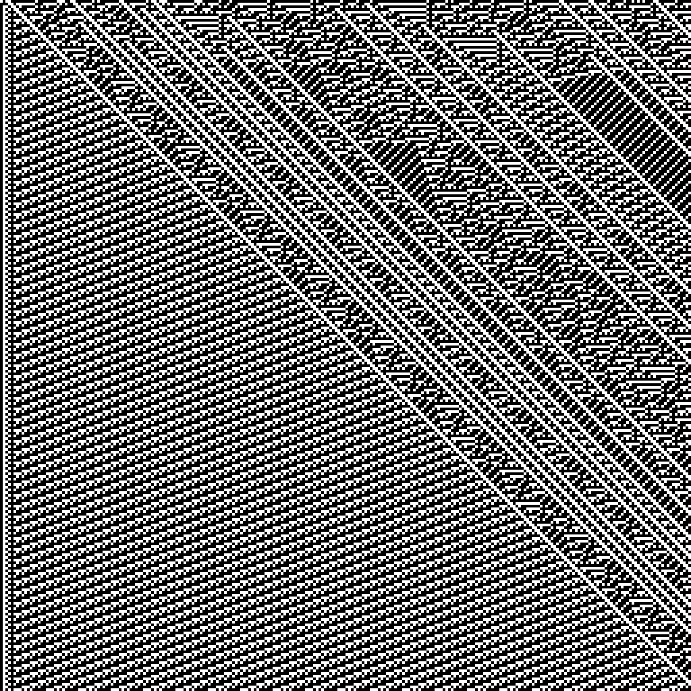

# wolfram-rules
This script creates a PNG-image of first generations of Wolfram's elementary cellular automaton from a random bit string using integer input as its rule.

[Elementary cellular automaton](https://en.wikipedia.org/wiki/Elementary_cellular_automaton "Elementary cellular automaton") page on Wikipedia

Made by p07010k in September 2020.

## Requirements
Python Imaging Library is needed. Install from pip:
```
pip install Pillow
```

## Usage
Run the `wolfram-rules.py` script. Input an integer from `0` to `255`. If left blank, `30` is entered as the default.
```
$ wolfram-rules.py
84
The picture is saved as 'rule_84_20210407231438.png'
```

## Examples of output images
Rule 30:


Rule 109:


## Further plans
`!` There is a bug which makes several left bits behave incorrectly. I am going to fix this.
Also, it would be nice to add some functionality as follows:
- let user to configure canvas size, colors and scaling coefficient;
- input their own initial string, not only random.
